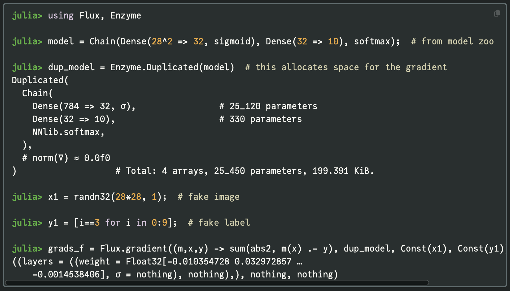
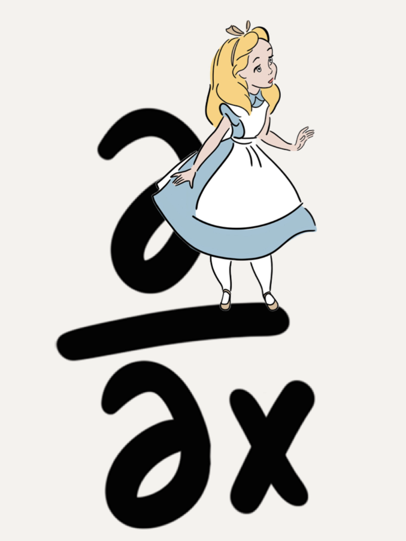

```{r}
#| setup: true
#| echo: false
#| warning: false
#| message: false

library(JuliaCall); JuliaCall::julia_setup()

```

### TLDR

Gradients guide us through daunting and unwieldy, high-dimensional models to draw samples from posterior distributions, take steps towards loss minimising parameter values, identify model vulnerabilities using adversarial methods, and more. One (of many) fun features about the `Julia` programming language is its unique approach to autodiff. 

In Part 1, I provide an intro to autodiff workflow in `Julia` and the emergence of the `Enzyme` library.I personally found some documentation a little difficult to follow, so this is intended to be a practical guide, with a couple of example use cases.

---

#### autodiff (AD)

So much of computational statistics and machine learning is built on automatic (algorithmic) differentiation - AD, "autodiff", or "autograd". Dig into literature on Bayesian inference, or deep learning, and you will find parameters being nudged in a direction informed by a gradient. I'm sometimes surprised at the extent of the 'gradient-based' monopoly in scientific computing, but I don't mean to trivialise! ...getting gradients of complex functions, very quickly and without error, is a powerful tool and its great that we are able to leverage this.

AD works by *"the relentless application of the chain rule"*, as I vaguely recall one of the `Stan` developers saying. Large functions are differentiated piece by piece (for which look-up rules can be applied), and the results are stitched together.

$$
\frac{\partial \mathcal{L}}{\partial x_i} = \frac{\partial \mathcal{L}}{\partial x_n} \times \frac{\partial x_n}{\partial x_{n-1}} \times \cdots \times \frac{\partial x_{i+1}}{\partial x_i}
$$

#### inter-operability and `Julia` ♥️💚💜

Perhaps my favourite feature of `Julia` is its inter-operability. Look at a GitHub repo for a `Julia` package and you will generally find the following:


`Julia` is so performant, that its libraries for scientific computing will work with normal variables - without needing to package up their own types. So solvers from `DifferentialEquations`, or neural networks defined in `Flux` can be immediately combined with the `Julia` probabilistic programming language, `Turing`.

If a new framework emerges in `Python`, an entirely new ecosystem may need to be developed to prop it up. This may involve duplicating existing but now incompatible functionality - think of `JAX` needing to implement its own `NumPy` module. ...whereas if you write a new `Julia` library, it could offer a vast range of applications as it is combined with other packages, which feels like potential for a multiplicative, rather than additive, impact.

Here I am, impressed that the interoperability of the `Copulas` package:

<blockquote class="twitter-tweet" data-conversation="none">
<p lang="en" dir="ltr">
<a href="https://t.co/ySAg1SM98g">pic.twitter.com/ySAg1SM98g</a>
</p>&mdash; Domenic Denicola (@Domenic_DF)
<a href="https://twitter.com/Domenic_DF/status/1620520031565275136?ref_src=twsrc%5Etfw">January 31, 2023</a>
</blockquote>
<script async src="https://platform.twitter.com/widgets.js" charset="utf-8"></script>

#### AD in `Julia`

ML frameworks in `Python` require you to work in their own syntax, with their specific types, and use their own in-built AD methods. Locking into a framework is not ideal, as you are limited to the methods they support and you need to juggle types of inputs and outputs.

Conversely, `Julia` works the other way around. You write your code, using whichever libraries, functions and types you want, *and then* you choose an AD library to get you the gradients you need.


Why does this feel so powerful? its the promise of gradient-based methods for your scientific problem, rather than a walled-off machine learning model. You can point an AD engine at the aspect of your analysis that you are interested in for more bespoke interrogation or optimisation.

I recently completed a project, which had an element of adversarial AI (counterfactual analysis and saliency maps), which I wrote in `JAX`, mainly as an excuse to learn `JAX`. I used their `NNX` module for neural networks, and found this to be unexpectedly restrictive. I wasn't able to run analysis that required gradients of outputs w.r.t. inputs, as I hit `NNX` errors/limitations that I wasn't able to resolve. I ended up re-writing everything in `Julia`.

Once upon a time there was `Zygote`: an AD library that powered ML in `Julia`. A great achievement, but limitations began to emerge. Because of how it operates on your code, it can struggle with certain features. This is similar to the so-called "sharp bits" of `JAX` ...though those limitations emerge for very different reasons. 

`Zygote` is also sometimes described as "*too permissive*". This is because it intercepts your code at some *intermediate representation* level (see note below), performs AD and then reassembles. `Julia`'s IR levels were designed for performance, not AD and so doesn't reliably detect and report errors in `Zygote`'s process. 

It is possible for AD solutions to work with the compiler, rather than against it — more on 
this in Part 2! But for now...

:::{.callout-note collapse="true"}
## IR in `Julia`
The `Julia` compiler doesn't go straight from your source text to machine code. It passes through several intermediate representations (progressively lower-level versions that are easier for the compiler to analyse and optimise).

What's cool is that we can actually view these with the below macros:

```{julia}
#| echo: false
using InteractiveUtils
```

```{julia}
# some nice high-level code
nice_function(x) = 2x + 1

# the "lowered" IR
@code_lowered nice_function(1.0)

# the "typed" IR
@code_typed nice_function(1.0)

# the LLVM level
@code_llvm nice_function(1.0)

# finally, actual machine code
@code_native nice_function(1.0)
```

:::

And then came `Enzyme`: an AD library that works at the LLVM level (your code is compiled first, and then the gradients are computed). This led to improvements in both performance and flexibility - we can now differentiate through mutation and control flow. This more resilient library has a steeper learning curve (imo), but (also imo) requiring more explicit instructions ends up making things clearer. 

I hope the below examples will help get you started.

#### example 1: a Bayesian linear regression 

How about computing the gradients we need for Hamiltonian Monte Carlo sampling. For a linear regression model, with inputs, $X$ and outputs, $y$:

$$
y \sim N(\alpha + \beta X, \sigma)
$$

with priors:

$$
\alpha \sim N(0, 3)
$$

$$
\beta \sim N(0, 3)
$$

$$
\sigma \sim \text{Exponential}(1)
$$

Let's put these in a tuple:

```{julia}
using Distributions

priors = (
    α_prior = Normal(0, 3), 
    β_prior = Normal(0, 3), 
    σ_prior = Exponential(1)
)
```

For numerical stability reasons MCMC typically works in negative log space, so the below function finds the unnormalised negative log posterior for our model. This could of course be sped-up, but I've tried to keep it friendly 😊

```{julia}
using Random

function neg_log_posterior(params::NamedTuple, priors::NamedTuple,
                          x::Vector, y::Vector)

    α = params.α; β = params.β; σ = params.σ
    
    # mean of likelihood
    μ_pred = α .+ x * β
    
    # increment the negative log likelihood for all observations
    neg_log_lik = 0.0
    for i in 1:length(y)
        neg_log_lik += -logpdf(Normal(μ_pred[i], σ), y[i])
    end
    
    # ...and for the priors
    neg_log_prior_α = -logpdf(priors.α_prior, α)
    neg_log_prior_β = -logpdf(priors.β_prior, β)
    neg_log_prior_σ = -logpdf(priors.σ_prior, σ)
    
    # summing in log space is equivalent to multiplying priors and likelihoods 😉
    return neg_log_lik + neg_log_prior_α + neg_log_prior_β + neg_log_prior_σ
end
```

To use this function, we need to define some inputs. Here, I'm just simulating some data, using "true" parameter values:

```{julia}
#| output: false
# 20 data points, why not...
n_samples = 20

# define a PRNG for reproducibility
prng = MersenneTwister(231123)

# inputs from a standard Gaussian
x = randn(prng, n_samples)

# outputs by sending inputs through a "true" model
α_true = 1/2; β_true = -1/2; σ_true = 2

y = α_true .+ x * β_true .+ σ_true * randn(prng, n_samples)

```

We can use `Enzyme` to get the gradients of the negative log posterior w.r.t. the model parameters - as required by Hamiltonian Monte Carlo. 

```{julia}
# where do i want gradients?
params_init = (
    α = rand(prng, priors.α_prior),
    β = rand(prng, priors.β_prior),
    σ = rand(prng, priors.σ_prior)
)
```

:::{.callout-note collapse="true"}
## quick note on forward vs. reverse mode AD

Imagine a function with $n_{in}$ inputs and $n_{out}$ outputs.

**Forward mode** answers: "if I nudge **one input**, how do **all outputs** 
change?" — so you need $n_{in}$ passes to cover every input.

**Reverse mode** answers: "for **one output**, how did **all inputs** 
contribute?" — so you need $n_{out}$ passes to cover every output.

Often, ML and Bayesian inference problems have many parameters (large $n_{in}$) but 
a single scalar output i.e. a loss, or a log probability density (small $n_{out}$). Reverse mode 
gets us gradients w.r.t. **all** parameters in one backward pass.

That said, the threshold isn't always obvious and I've had cases where switching modes gave a noticeable speedup, so it's worth experimenting!

`Julia` has dedicated packages for each: `ForwardDiff.jl` and `ReverseDiff.jl` as part of its AD ecosystem. These are solid and well-established, but aren't the focus of this post.
:::

I am giving the `gradient()` function three arguments:

* **the mode/direction to apply AD**, `Reverse`.
  Each pass of a reverse-mode AD computes gradients of all inputs w.r.t. a single output (as a vector-Jacobian product). In Forward mode, each pass computes gradients of a single input w.r.t. all outputs (as a Jacobian-vector product). 
  
  See above callout note for more on this and why reverse mode is likely not an optimal choice for so few parameters.
  
  Consequently, there are efficiency trade-offs associated with this selection, depending on the number of inputs and outputs of...

* **...the function we are differentiating**, `params -> neg_log_posterior(params, priors, x, y)`.
  Here, an anonymous function that takes `params` as input and returns the negative log posterior, using `neg_log_posterior()`, which we defined above.

* **the point at which we want gradients**, `params_init`.
  This is the current location of the Markov chain. In the first instance we need an initial guess, for which we have drawn from the priors.

```{julia}
using Enzyme
# computing the gradients
∇θ = Enzyme.gradient(
    Reverse, 
    params -> neg_log_posterior(params, priors, x, y), 
    params_init
)
```

We can then use these gradients to update the momentum of our Hamiltonian 'particles', generating proposals guided by the geometry of the posterior distribution. Unlike random walks or Gibbs samplers, this generation of samplers remain efficient in high dimensions 🥳

#### example 2: an MLP (simple neural network)

I defined a simple, densely connected neural network without anything clever (no layer normalisations, recurrent connections or attention mechanisms), sometimes referred to as a multi-layer perceptron (MLP). 

I'll spare you this set-up code here as we are focussing on autodiff, but you can find the full code [on GitHub](https://github.com/DomDF/autodiff_experiments).

Instead, let's look at my training function. Notice that I am now using a different function, `Enzyme.autodiff()` for backpropagation. It has more arguments:

* **the mode/direction to apply AD**, `set_runtime_activity(Reverse)`.
  Similar to `gradient()`, but here we are specifying that we want to use reverse-mode AD, with runtime activity analysis. As a rule of 👍, I start with regular `Reverse` mode AD. If I get compilation errors about, for instance, type inference or broadcasting, then I add `set_runtime_activity()`.
* **the function we are differentiating**, `(net, funs, inputs, targets) -> find_loss(net, funs, inputs, targets)`.
  Here, an anonymous function that takes the neural network, its functions, inputs and targets as arguments, and returns the loss.
* **the activity of the function** `Active`.
  we need to make the output to the loss function active, because it is the starting point of the chain rule. 
* **the activity of each argument**, `Active`, `Const()`, or `Duplicated()`.
  This is where things get more explicit. We need to tell `Enzyme` which arguments we want gradients for (`Active`), and which we don't (`Const`) - the derivative of a constant is zero.
  Finally, we also want gradients for `Duplicated` variables, but they could be large. So we create a shadow copy of the neural network, `nn_shadow`, which we use to accumulate gradients in-place (without allocating new memory each time!)


```{julia}
#| eval: false
function train(nn::neural_network, nn_funs::neural_network_funs, 
               a::Array{Float64}, y::Array{Float64};
               a_test::Array{Float64} = a, y_test::Array{Float64} = y, 
               n_epochs::Int = 10, η::Float64 = 0.01)
    @assert n_epochs > 0 "n_epochs must be greater than 0"

    training_df = DataFrame(epoch = Int[], loss = Float64[], test_loss = Float64[])

    for i in 1:n_epochs

        # initiate our memory-saving shadow
        ∇nn = Enzyme.make_zero(nn)

        # find ∂ℒ/∂θ
        Enzyme.autodiff(
            set_runtime_activity(Reverse),
            (net, funs, inputs, targets) -> find_loss(net, funs, inputs, targets)[1],
            Active,
            Duplicated(nn, ∇nn),
            Const(nn_funs),
            Const(a),
            Const(y)
        )

        # nudge all weights and biases towards a lower loss, using learning rate, η
        for j = 1:length(nn.Ws)
            nn.Ws[j] -= η * ∇nn.Ws[j]
            nn.bs[j] -= η * ∇nn.bs[j]
        end
        
        # record losses
        append!(training_df, 
                DataFrame(epoch = i, 
                          loss = find_loss(nn, nn_funs, a, y)[1],
                          test_loss = find_loss(nn, nn_funs, a_test, y_test)[1]))

    end
    
    return nn, training_df
end
```

`Enzyme.make_zero(nn)` creates a structural copy of `nn` with the same type (neural_network), field names (Ws, bs), and dimensions ...but with all numerical values set to zero. This memory-saving trick is important for large vectors of parameters, as we will generally have in deep learning.
 
The example applications that I selected are already very well equipped with sophisticated `Julia` libraries. If you are interested in probabilistic modelling in `Julia`, use `Turing`, if you are interested in deep learning, use `Flux`. Both are Enzyme compatible, but the later has specific guidance on how to set this up, using the `Duplicated` method that we used above:




#### some references

The `Julia` autodiff ecosystem, which is more vast than the examples covered in this blog post, [link](https://juliadiff.org)

A summary of the key trade-offs accross various autodiff methods, [link](https://www.stochasticlifestyle.com/engineering-trade-offs-in-automatic-differentiation-from-tensorflow-and-pytorch-to-jax-and-julia/)

Professor Simone Scardapone's book, "Alice's adventures in a differential wonderland" [link](https://www.sscardapane.it/assets/alice/Alice_book_volume_1.pdf).

*"As the name differentiable implies, gradients play a pivotal role"*



JuliaCon talk on `Julia`'s unique approach to autodiff:

